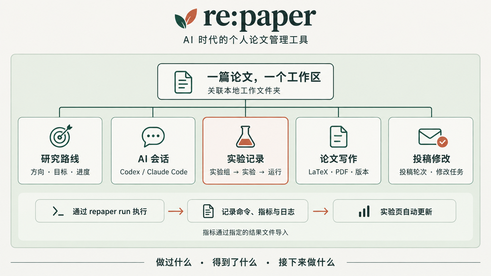

# re:paper



### 管好你正在做的每一篇论文

**面向 AI 辅助科研的一站式本地论文管理与工作流工具**

[下载安装](#download) · [核心功能](#features) · [实验记录机制](#experiments) · [完整使用说明](docs/usage.md) · [源码构建](#development) · [构建与发布](docs/releases.md)

---

## 💡 为什么需要 re:paper？

当 AI 开始帮你写代码、跑消融实验、探索新思路时，**“做实验”变快了，但“管理科研”变繁琐了**：

* ❓ *“上周试过的那个思路效果如何？为什么停掉了？”*
* ❓ *“这个图表的数据来自哪一次运行？代码和参数是什么？”*
* ❓ *“和 AI 讨论出最佳方案的上下文放在哪个 CLI 会话里了？”*
* ❓ *“这篇论文审稿意见里的第 3 条修改做完了吗？”*

以往，你需要手动抄写指标、整理日志、更新笔记、跨多个窗口查找记录。

**re:paper 重新定义了科研工作区**：以**单篇论文**为核心单元，把研究路线、AI 会话、实验记录、LaTeX 写作与投稿修改整合在一起。配合专属 CLI 与 Agent Skill，让实验在**运行的同时自动生成可追溯的结构化记录**。

---

<a id="features"></a>

## ✨ 核心功能

| 科研管理痛点 | re:paper 解决方案 |
| --- | --- |
| **多论文并行推进** | **论文库与视图**：清晰展示各论文的研究阶段、简介、标签，支持快速搜索与一键切换。 |
| **研究路线分散** | **路线规划**：管理不同探索方向的目标、当前状态与实现记录，避免思路遗忘。 |
| **AI 会话难以溯源** | **原生 AI 会话集成**：按项目绑定并继续 Codex / Claude Code 会话，内置终端协同。 |
| **实验记录繁琐无序** | **自动实验追踪**：三层管理（实验组 → 实验 → 运行），自动记录命令、日志、指标与 Git 状态。 |
| **写作与代码脱节** | **LaTeX 集成管理**：集成 LaTeX 编辑、PDF 实时预览、 Git 差异对比与版本历史。 |
| **投稿修改乱成一团** | **投稿全流程跟进**：管理投稿轮次、重投关联、修改任务列表、进度及 Cutoff 截止日期。 |

---

<a id="experiments"></a>

## 🏗️ 实验记录机制

一个研究问题通常包含多个实验，每个实验又会经历多次迭代运行。re:paper 采用标准的**三层结构**进行组织：

```text
实验组 (Group)：例如 "跨数据集评测"
├── 实验 (Experiment)：例如 "A 数据集测试"
│   ├── 运行 1 (Run)：命令 | 起止时间 | 退出码 | 日志 | 指标 | Git 提交状态
│   └── 运行 2 (Run)：命令 | 起止时间 | 退出码 | 日志 | 指标 | Git 提交状态
└── 实验 (Experiment)：例如 "B 数据集测试"
    └── 运行 1 (Run)...

```

### 方式一：配合 AI Agent 自动记录 (推荐)

安装配套 Skill 后，可以在 Codex 或 Claude Code 会话中直接下达自然语言指令：

> "对比基线和新方法在 A 数据集上的表现。使用 re:paper 创建实验记录，运行时保留日志和指标，检查结果后再写摘要和结论。"

### 方式二：命令行 CLI 工具

通过 `repaper` 命令直接在终端管理实验（支持自动抓取 JSON 格式指标与产物文件）：

```bash
# 1. 创建/确保实验组存在
repaper group ensure benchmark --title "跨数据集评测" --goal "检验泛化能力" --metric accuracy:max

# 2. 创建/确保具体实验项
repaper experiment ensure benchmark/data-a --title "A 数据集" --question "是否优于基线？"

# 3. 运行实验并自动收集指标与产物
repaper run benchmark/data-a --metrics results/a.json --artifact results/a.json -- python eval.py --dataset A

# 4. 查看当前记录状态
repaper status --json

```

> [!NOTE]
> `repaper run` 会实时流式输出日志，并记录起止时间、退出码、Git commit/工作区状态等。应用内实验页将随文件变化实时自动刷新。

---

<a id="download"></a>

## 📦 下载与快速开始

### 1. 下载安装应用 (推荐)

当前可下载 [👉 v0.1.0 预发布版](https://github.com/X3NNY/repaper/releases/tag/v0.1.0)，或前往 [全部 Releases](https://github.com/X3NNY/repaper/releases) 查看其他版本。请按系统和 CPU 架构选择安装包，也可以使用下方源码启动方式。

| 操作系统 | 下载文件 | 说明 |
| --- | --- | --- |
| **Windows x64** | `repaper-x.x.x-win-x64.exe` | NSIS 安装包 |
| **macOS Intel** | `repaper-x.x.x-mac-x64.dmg` / `.zip` | Intel 版本 |
| **macOS Apple Silicon** | `repaper-x.x.x-mac-arm64.dmg` / `.zip` | Apple Silicon 版本 |
| **Linux x64** | `repaper-x.x.x-linux-x86_64.AppImage` / `repaper-x.x.x-linux-x64.tar.gz` | AppImage 或解压运行 |

当前 Windows 包未使用发行商证书，macOS 包采用 ad-hoc 签名，尚未 notarize。系统可能显示安装安全提示；详情见[签名与安装说明](docs/releases.md#签名与安装提示)。

> [!TIP]
> 第一次启动可以点击界面上的 **“载入示例项目”**，快速熟悉论文库与各类记录的组织方式。

### 2. 环境依赖准备（按需）

根据你需要使用的功能，在本地准备对应的命令行工具：

* **AI 会话**：已安装并登录的 [Codex CLI](https://github.com/openai/codex) 或 [Claude Code](https://github.com/anthropics/claude-code)。
* **LaTeX 写作与编译**：本地安装有 Git 与 TeX 发行版（如 TeX Live / MiKTeX，需要 `pdflatex` / `xelatex` 和 `bibtex`；IEEE 模板需 `IEEEtran.cls`）。
* **实验运行环境**：你的实验代码及其运行环境（如 Python、PyTorch、数据集依赖等）。

---

## 📂 本地优先与数据结构

re:paper 坚持 **Local-First（本地优先）** 理念，你的所有科研数据与代码均保存在本地磁盘：

| 数据内容 | 保存位置 |
| --- | --- |
| **论文项目 / 路线 / 投稿任务** | `%APPDATA%\repaper\workspace.json`（Windows 默认） |
| **实验记录与运行日志** | 对应论文工作目录中的 `.repaper/experiments/` |
| **LaTeX 手稿与写作 Git 历史** | 对应论文工作目录中的 `.paper/` |
| **PDF 编译产物** | 对应论文工作目录中的 `.paper/.build/`（默认不计入 Git 提交） |
| **AI 会话历史** | 各 AI 工具（Codex/Claude Code）原有的本地数据目录 |

> [!IMPORTANT]
> **数据备份**：保留应用的 `workspace.json` 及各论文工作文件夹；AI 会话历史还需按对应工具的方式备份。

---

<a id="development"></a>

## 🛠️ 源码构建与开发

如果你希望对 re:paper 进行修改或参与贡献，可以从源码构建：

### 环境要求

* Node.js `>= 22.12`
* npm（仓库提供 `package-lock.json`，CI 使用 `npm ci`）

### 启动步骤

```bash
# 克隆仓库并安装依赖
git clone https://github.com/X3NNY/repaper.git
cd repaper
npm install

# 启动开发环境
npm run dev

# 编译代码并预览
npm run build
npm run preview

```

生成本机安装包使用 `npm run dist`，产物保存在 `dist/`。推送与项目版本一致的 `v*` 标签后，GitHub Actions 会在四个系统/架构组合上构建并检查打包后的 CLI 和原生终端，全部成功后创建 Release 草稿。完整命令和发布步骤见[构建与发布](docs/releases.md)。

### 项目结构

```text
repaper/
├── src/                         # React 界面与 UI 组件
├── electron/main/               # Electron 主进程（文件访问、终端、编译、Git、实验管理）
├── electron/preload/            # Preload 桥接 API
├── shared/                      # 前后端共享数据类型
├── cli/                         # repaper CLI 工具源码
├── skills/repaper-experiments/  # Agent 实验记录 Skill
└── tests/                       # 单元测试与界面检查脚本

```

```bash
# 类型检查与测试
npm run typecheck
npm run test:experiments

```

欢迎围绕真实的科研工作流提交 Issue 或 Pull Request！

---

## 📄 许可协议

本项目基于 [MIT License](LICENSE) 开源。
